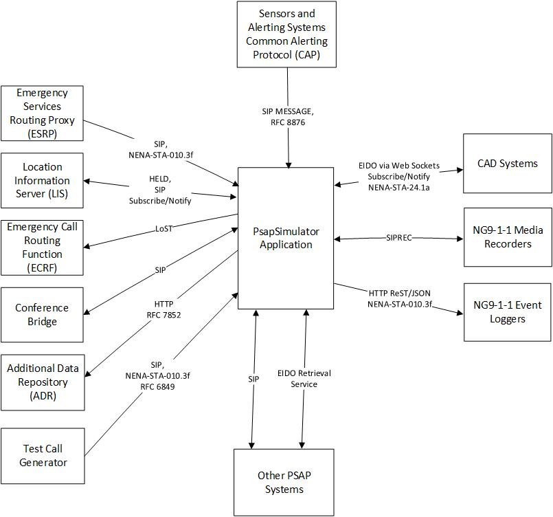

# The PsapSimulator Application
The PsapSimulator application is a test program. The intended uses of this application are:
1. Assist in interoperability testing of Next Generation 9-1-1 (NG9-1-1) Emergency Services IP Network (ESInet) functional elements that deliver NG9-1-1 calls to NG9-1-1 capable Public Safety Answering Points (PSAPs).
2. Provide a way to perform integration testing of the various NG9-1-1 interfaces that have been implemented in the [SipLib](https://github.com/PhrSite/SipLib), [Ng911Lib](https://github.com/PhrSite/Ng911Lib), [EidoLib](https://github.com/PhrSite/EidoLib) and [Ng911CadIfLib](https://github.com/PhrSite/Ng911CadIfLib) open source class libraries.
3. Provide a proof of concept implementation of the less commonly implemented interfaces specified in the most recent version of the NENA i3 Standard for Next Generation 9-1-1 Standard (NENA-STA-010.3f).

This application is a simplified PSAP call handling functional element. It is a single call taker position application that can handle multiple calls simultaneously, but the call taker can only communicate with a single caller at a time. There is no centralized PSAP call controller so functions such as automatic call distribution, call queue pickup, call takeover, barge-in, local transfers (within the same PSAP), local conferences, administrative (non-emergency, i.e. an interface to an agency`s PBX) call handling and other functions that are normally expected in a PSAP application will not be available.

The following block diagram shows the NG9-1-1 functional elements that the PsapSimulator application can interface to.

Please refer to the [Operators Manual](docs/GettingStarted.md) for instructions on how to install and use this application.

This is an open source project. The GitHub repository is called [PsapSimulator](https://github.com/PhrSite/PsapSimulator).
