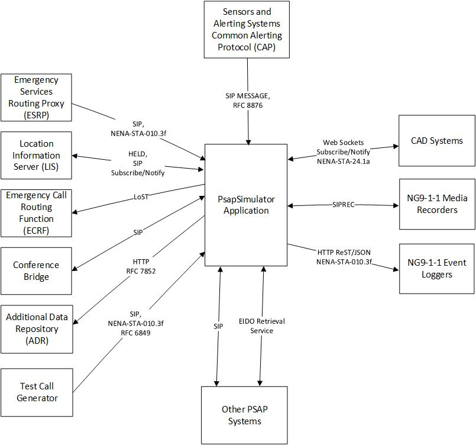

# Introduction
The PsapSimulator application is a test program. The intended uses of this application are:
1. Assist in interoperability testing of Next Generation 9-1-1 (NG9-1-1) call Emergency Services IP Network (ESInet) functional elements that deliver NG9-1-1 calls to NG9-1-1 capable Public Safety Answering Points (PSAPs).
2. Provide a way to perform integration testing of the various NG9-1-1 interfaces that have been implemented in the [SipLib](https://github.com/PhrSite/SipLib), [Ng911Lib](https://github.com/PhrSite/Ng911Lib), [EidoLib](https://github.com/PhrSite/EidoLib) and [Ng911CadIfLib](https://github.com/PhrSite/Ng911CadIfLib) open source class libraries.
3. Provide a proof of concept implementation of the less commonly implemented interfaces specified in the most recent version of the NENA i3 Standard for Next Generation 9-1-1 Standard (NENA-STA-010.3f).

This application is a simplified PSAP call handling functional element. It is a single call taker position application that can handle multiple calls simultaneously, but the call taker can only communicate with a single caller at a time. There is no centralized PSAP call controller so functions such as automatic call distribution, call queue pickup, call takeover, barge-in, local transfers (within the same PSAP), local conferences, administrative (non-emergency, i.e. an interface to an agency’s PBX) call handling and other functions that are normally expected in a PSAP application will not be available.

The following block diagram shows the NG9-1-1 functional elements that the PsapSimulator application can interface to.

## NG9-1-1 Functional Element Interface Support
Section 4.6 of NENA-STA-010.3f specifies which functional element interfaces that the PSAP call handling functional element must support.

The following table shows which interfaces and the degree of support that this application provides. The degree of support is indicated in the “Supported?” column.

| NENA-STA-010.3f Section | Supported? | Implemented? | Description |
|-------------------------|------------|-------------|
| 4.6.1 SIP Call Interface | Full Support | Yes |  |
| 4.6.2 Media | Full Support | Yes | This application supports multimedia calls with any combination of audio, video, Real Time Text (RTT) and MSRP text |
| 4.6.3 LoST Interface | Full Support | No |   |
| 4.6.4 LIS Interfaces | Full Support | Yes |  |
| 4.6.5 Bridge Interface | No | No | This section of NENA-STA-010.3f states that the PSAP MAY provide its own conference bridge. The application shall support call conferencing and call transfers via an external conference aware user agent (i.e. a conference bridge). |
| 4.6.6 Element State | Full Support | Yes |  |
| 4.6.7 Service State | Full Support | Yes |  |
| 4.6.8 Abandoned Call Event | No | No | Future |
| 4.6.9 De-queue Registration | Full Support | No |  |
| 4.6.10 Queue State | Full Support | Yes |  |
| 4.6.11 SI | No | No | Support for the Spatial Interface of a GIS server is optional in NENA-STA-010.3f. |
| 4.6.12 Logging Service | Full Support | Yes |  |
| 4.6.13 Security Posture | Full Support | Yes |  |
| 4.6.14 Policy | No | No | Support for the Policy Store is optional in NENA-STA-010.3f. |
| 4.6.15 Additional Data Dereference | Full Support | No |  |
| 4.6.16 Time Interface | Yes | No | Via the Windows NTP Interface |
| 4.6.17 Test Call | Full Support | Yes |  |
| 4.6.18 Testing of Policy Rules | No | No | Support for this function appears to be optional in NENA-STA-010.3f. |
| 4.6.19 Call Diversion | Yes | No | Because De-Queue Registration will be supported. Element State, Service State and Queue state are already implemented. |

# Dependancies

## FFMPEG Libraries
This project depends on the FFMPEG libraries for video codecs and other video related functions. These DLL files are automatically installed in the FFMPEG directory located under the applications installation directory.

This repository contains the FFMPEG DLL files.

The application currently uses version 7.0.0 of FFMPEG.

The version of the FFMPEG DLL files must match the version of FFMPEG.AutoGen. If FFMPEG.AutoGen is updated, the FFMPEG DLL files in this repository must also be updated.

The best place to get the correct version of the FFMPEG DLL files is: https://github.com/Ruslan-B/FFmpeg.AutoGen/tree/master/FFmpeg/bin/x64.

